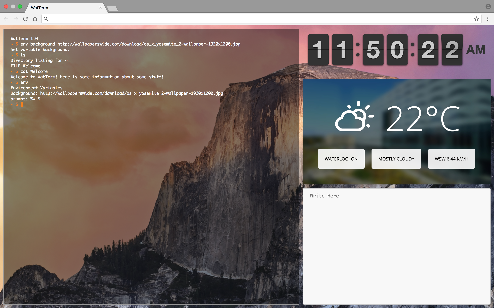

# WatTerm (React) 
WatTerm is a Chrome extension that transforms your new tab page into a multi-windowed terminal environment.

This is a WIP re-write of [WatTerm](https://github.com/fg123/wat-term) using React, Redux, and webpack.

## Build
- `git clone https://github.com/LenKagamine/wat-term-react.git`
- `npm install`
- `npm run webpack`
  - This will also make webpack to watch for changes and rebuild on save

To build a production version, run `npm run prod`.

To run the extension, load the `build` directory into Chrome and open a new tab.

